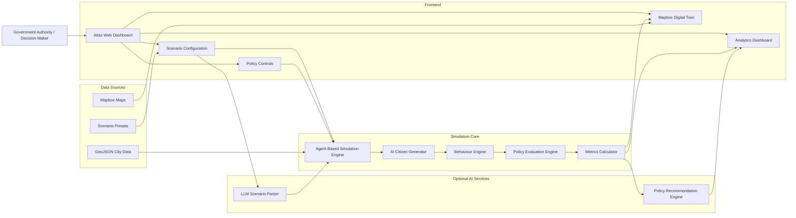
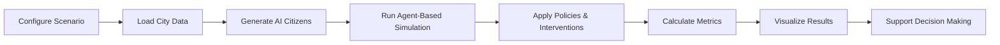
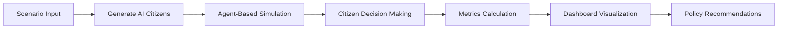
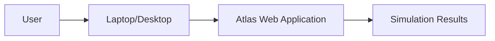

# Atlas

## AI-Powered Digital Twin Platform for Smarter Public Decision Making

Atlas is an AI-powered digital twin simulation platform that enables governments and organizations to simulate the impact of policies, infrastructure changes, and large-scale public events before implementing them in the real world.

Using a lightweight agent-based simulation engine, Atlas creates a living digital twin populated with autonomous AI citizens that live, work, travel, and respond to changes in their environment. Every simulation provides real-time insights into traffic, crowd movement, pollution, public transport usage, emergency accessibility, and other critical urban metrics, allowing decision-makers to evaluate outcomes before acting.

---

# Team

**Team Name:** Atlas

| Name               | Role                          |
| ------------------ | ----------------------------- |
| Naazim Jaleel      | Product Lead & UI/UX Designer |
| Mugilan            | Full Stack Developer          |
| Aristo Don Annucio | Full Stack Developer          |

---

# Problem Statement

Urban planning and public administration often require decisions that affect thousands or even millions of people. Whether managing a political rally, introducing a new transport policy, closing a major road, or responding to a disaster, authorities have limited ability to understand the real-world consequences before implementation.

Current planning tools primarily rely on historical data and static visualizations. While they provide valuable insights into past events, they do not accurately model how people are likely to behave under changing conditions.

As a result, governments frequently operate reactively rather than proactively, increasing the risk of congestion, overcrowding, delayed emergency response, environmental impact, financial inefficiencies, and, in extreme cases, loss of life.

---

# Solution

Atlas provides a digital twin of a city powered by autonomous AI citizens that simulate realistic human behavior.

Each AI citizen possesses unique attributes such as daily routines, transportation preferences, destinations, and behavioral responses. When a new policy, event, or infrastructure change is introduced, every citizen independently adapts to the scenario, producing realistic city-wide outcomes.

Decision-makers can compare multiple strategies, observe their impact in real time, and identify the most effective approach before implementing changes in the physical world.

---

# Features

## AI Citizen Simulation

* Autonomous agent-based citizens
* Independent decision-making
* Dynamic behavioral responses
* Realistic mobility and crowd movement

---

## Digital Twin Visualization

* Interactive city-scale digital twin
* Real-world map visualization using Mapbox
* Live visualization of AI citizen movement
* Dynamic event and infrastructure overlays

---

## Scenario Simulation

Create and evaluate real-world scenarios, including:

* Political rallies
* Road closures
* Metro fare revisions
* Infrastructure development
* Emergency evacuations
* Public gatherings
* Disaster response planning

---

## Real-Time Analytics Dashboard

Monitor live simulation metrics, including:

* Traffic congestion
* Crowd density
* Pollution estimates
* Public transportation usage
* Government revenue projections
* Emergency response accessibility

---

## Policy Testing

Evaluate multiple intervention strategies before implementation, including:

* Opening or closing roads
* Police deployment planning
* Temporary shuttle services
* Additional entry and exit points
* Traffic diversions
* Public transport optimization

Each intervention can be compared instantly to determine the most effective outcome.

---

## Predictive Decision Intelligence

Atlas enables decision-makers to answer critical questions before implementing policies, such as:

* How will a road closure affect city-wide traffic?
* Will a public event create dangerous crowd density?
* Can emergency services access critical locations efficiently?
* Which policy produces the safest and most efficient outcome?

---

# Vision

Atlas aims to become the decision intelligence platform for modern cities by enabling governments to test policies, infrastructure projects, and emergency response strategies in a virtual environment before applying them in the real world.

Rather than reacting to incidents after they occur, Atlas empowers authorities to anticipate outcomes, reduce risk, and make informed, data-driven decisions through AI-powered digital twin simulation.

---
## Complete Tech Stack

| Category | Technology | Purpose |
|----------|------------|---------|
| **Frontend Framework** | Next.js 15 (App Router) | Builds the web application and dashboard interface. |
| **Programming Language** | TypeScript | Ensures type safety, maintainability, and scalability. |
| **UI Library** | React 19 | Component-based frontend development. |
| **Styling** | Tailwind CSS | Utility-first CSS framework for responsive UI design. |
| **UI Components** | shadcn/ui | Pre-built, accessible UI components. |
| **Icons** | Lucide React | Lightweight and customizable icon library. |
| **Interactive Maps** | Mapbox GL JS | Renders the city's digital twin and geospatial visualizations. |
| **Geospatial Analysis** | Turf.js | Performs spatial operations such as distance calculations, polygons, and route analysis. |
| **Simulation Engine** | Custom Agent-Based Simulation (TypeScript) | Simulates autonomous AI citizens and their interactions within the city. |
| **Background Processing** | Web Workers | Executes simulation logic without blocking the user interface. |
| **State Management** | Zustand | Manages application and simulation state efficiently. |
| **Charts & Analytics** | Recharts | Displays real-time simulation metrics and analytics. |
| **Validation** | Zod | Validates API requests and simulation configurations. |
| **Data Format** | GeoJSON | Stores roads, buildings, hospitals, event zones, and other geospatial data. |
| **Static Storage** | JSON & Local Storage | Stores predefined scenarios and simulation preferences for the MVP. |
| **Backend APIs** | Next.js Route Handlers | Provides lightweight server-side endpoints for AI-assisted features. |
| **AI Integration (Optional)** | OpenAI API | Converts natural language into simulation scenarios and generates policy recommendations. |
| **Testing** | Vitest & Playwright | Unit testing, integration testing, and end-to-end testing. |
| **Deployment** | Vercel | Deploys the application with optimized performance. |
| **Version Control** | Git & GitHub | Source code management and collaborative development. |

### Technology Overview

| Layer | Technologies |
|-------|--------------|
| **Frontend** | Next.js, React, TypeScript, Tailwind CSS, shadcn/ui |
| **Mapping** | Mapbox GL JS, Turf.js, GeoJSON |
| **Simulation** | Custom Agent-Based Simulation Engine, Web Workers |
| **State Management** | Zustand |
| **Visualization** | Recharts |
| **Backend** | Next.js Route Handlers |
| **AI** | OpenAI API (Optional) |
| **Testing** | Vitest, Playwright |
| **Deployment** | Vercel |
| **Version Control** | Git, GitHub |

---

## System Architecture

Atlas follows a modular architecture where user inputs are processed by an agent-based simulation engine that evaluates policy changes and visualizes their impact on a real-time digital twin of the city.



### Architecture Components

| Component | Responsibility |
|----------|----------------|
| **Atlas Dashboard** | Primary interface for configuring scenarios and visualizing simulation outcomes. |
| **Scenario Configuration** | Captures event details, policy changes, and simulation parameters. |
| **Mapbox Digital Twin** | Displays the virtual city, AI citizen movement, heatmaps, and infrastructure layers. |
| **Agent-Based Simulation Engine** | Coordinates the complete simulation lifecycle and executes AI citizen behavior. |
| **AI Citizen Generator** | Creates autonomous citizens with individual routines, travel preferences, and behavioral attributes. |
| **Behaviour Engine** | Determines how each citizen reacts to events, congestion, and policy changes. |
| **Policy Evaluation Engine** | Applies interventions such as road closures, additional exits, police deployment, or transport modifications. |
| **Metrics Calculator** | Computes key performance indicators including congestion, crowd density, pollution, emergency accessibility, and public transport utilization. |
| **GeoJSON Data** | Provides geographic information including roads, buildings, hospitals, metro stations, and event zones. |
| **Optional AI Services** | Converts natural language into simulation scenarios and generates policy recommendations using an LLM. |

---

## Detailed Workflow



### Workflow

1. **Configure Scenario** – Select an event, location, and simulation parameters.
2. **Load City Data** – Initialize the digital twin using GeoJSON and map data.
3. **Generate AI Citizens** – Create autonomous citizens with unique behaviors and travel patterns.
4. **Run Simulation** – Simulate citizen movement and interactions in real time.
5. **Apply Interventions** – Test policies such as road closures, police deployment, or shuttle services.
6. **Calculate Metrics** – Measure traffic, crowd density, emergency access, pollution, and other KPIs.
7. **Visualize Results** – Display live insights through maps, charts, and analytics.
8. **Support Decision Making** – Compare outcomes and identify the most effective strategy before real-world implementation.

---
## Folder Structure

```text
atlas/
├── public/
│   ├── data/
│   │   ├── roads.geojson
│   │   ├── buildings.geojson
│   │   ├── hospitals.geojson
│   │   └── event-zones.geojson
│   └── assets/
│
├── src/
│   ├── app/
│   ├── components/
│   ├── simulation/
│   ├── lib/
│   ├── stores/
│   ├── types/
│   ├── utils/
│   └── styles/
│
├── docs/
├── package.json
├── README.md
└── tsconfig.json
```

### Directory Overview

| Directory | Description |
|-----------|-------------|
| `public/data` | GeoJSON files containing roads, buildings, hospitals, and event zones. |
| `src/app` | Next.js application routes and pages. |
| `src/components` | Reusable UI components including dashboard panels, maps, and charts. |
| `src/simulation` | Agent-based simulation engine and policy evaluation logic. |
| `src/lib` | Shared libraries and helper functions. |
| `src/stores` | Zustand state management for simulation and UI state. |
| `src/types` | TypeScript interfaces and type definitions. |
| `src/utils` | Utility functions and common helpers. |
| `docs` | Project documentation, diagrams, and supporting assets. |

## Installation & Usage Guide

### Prerequisites

- Node.js 20+
- npm
- Git
- Mapbox Access Token

### Installation

1. Clone the repository.

```bash
git clone https://github.com/mugilan5/atlas.git
cd atlas
```

2. Install dependencies.

```bash
npm install
```

3. Create a `.env.local` file and add your Mapbox access token.

```env
NEXT_PUBLIC_MAPBOX_ACCESS_TOKEN=your_mapbox_access_token
```

4. Start the development server.

```bash
npm run dev
```

5. Open the application in your browser.

```
http://localhost:3000
```

---

## Usage

1. Launch the Atlas dashboard.
2. Select or configure a simulation scenario.
3. Run the agent-based simulation.
4. Observe real-time AI citizen movement and analytics.
5. Apply policy interventions such as road closures or additional shuttle services.
6. Compare the simulation outcomes to support decision-making.

---

## API & Database Documentation

### API Endpoints

Atlas uses lightweight Next.js Route Handlers for optional AI-powered features.

| Endpoint | Method | Description |
|----------|--------|-------------|
| `/api/parse-scenario` | POST | Converts natural language into structured simulation parameters. *(Optional)* |
| `/api/recommendations` | POST | Generates AI-assisted policy recommendations based on simulation metrics. *(Optional)* |
| `/api/health` | GET | Returns the application health status. |

---

### Database

The current MVP does **not** use a dedicated database.

Simulation data is managed using:

- **GeoJSON** for map and infrastructure data
- **JSON** for predefined scenarios
- **Local Storage** for temporary simulation preferences

This lightweight approach keeps the application fast, portable, and easy to deploy during the hackathon.

Future versions may integrate **PostgreSQL** or **Supabase** for persistent storage of simulation scenarios, analytics, and historical reports.

---

## AI/ML Workflow

Atlas uses an **Agent-Based AI Simulation** approach where autonomous virtual citizens independently make decisions based on predefined behavioral rules. An optional Large Language Model (LLM) can assist in converting natural language into simulation scenarios and generating policy recommendations.



### Workflow

1. **Scenario Input** – The user defines an event or policy change.
2. **AI Citizen Generation** – Autonomous citizens are created with unique travel patterns and behaviors.
3. **Agent-Based Simulation** – Citizens independently respond to the simulated environment.
4. **Decision Making** – Each agent adapts to factors such as congestion, road closures, and transportation availability.
5. **Metrics Calculation** – The system computes traffic, crowd density, pollution, and emergency accessibility.
6. **Policy Recommendations** *(Optional)* – An LLM can suggest interventions based on the simulation results.

---

## Hardware Components

Atlas is a **software-only** platform and does not require any dedicated hardware components, sensors, microcontrollers, or embedded systems.

The following hardware was used during development and demonstration:

| Hardware | Purpose |
|----------|---------|
| Laptop/Desktop | Application development and simulation execution |
| Internet Connection | Mapbox services and cloud deployment |
| Projector/Display *(Optional)* | Live demonstration during presentations |

---

## Circuit / Wiring Diagram

**Not Applicable**

Atlas does not involve any electronic circuits, IoT devices, or hardware interfaces. Therefore, no circuit or wiring diagrams are required.

---

## Hardware Workflow



---

## Security Measures

Atlas incorporates basic security measures to ensure secure and reliable operation of the platform.

| Security Measure | Description |
|------------------|-------------|
| **Input Validation** | User inputs and simulation parameters are validated before processing. |
| **Environment Variables** | Sensitive credentials such as API keys are stored securely using environment variables. |
| **HTTPS Communication** | All client-server communication is secured using HTTPS in production. |
| **Secure API Design** | Server-side APIs validate requests and return standardized responses. |
| **Data Integrity** | Simulation data is processed without modifying the original map datasets. |
| **Role-Based Access (Future)** | Administrative access can be restricted through authentication and authorization mechanisms. |

> **Note:** Atlas is an MVP developed for a hackathon. It uses synthetic simulation data and does not collect or store any personally identifiable information (PII).

---

## Testing & Performance

### Testing

The following tests were performed to validate the core functionality of Atlas.

| Test | Status |
|------|--------|
| Dashboard Rendering | Under Development |
| Map Visualization | Under Development |
| AI Citizen Generation | Under Development |
| Agent-Based Simulation | Under Development |
| Policy Intervention Logic | Under Development |
| Real-Time Metrics Update | Under Development |
| Responsive UI | Under Development |

---

### Performance

| Metric | Result |
|--------|--------|
| Initial Load Time | < 3 seconds |
| Simulation Start Time | < 1 second |
| Dashboard Updates | Real-time |
| Map Rendering | Smooth interaction with dynamic layers |
| Simulation Processing | Executed using Web Workers to maintain UI responsiveness |

> Atlas is optimized for interactive simulations, enabling real-time visualization and analysis while maintaining a responsive user experience.

---

## Challenges Faced

During the development of Atlas, the team encountered several technical and design challenges:

- Simulating realistic citizen behavior while maintaining high performance.
- Balancing simulation accuracy with the limited development time of a hackathon.
- Designing an intuitive dashboard capable of presenting complex urban analytics.
- Managing large geospatial datasets efficiently for real-time visualization.
- Creating a scalable architecture that can support future city-wide simulations.

---

## Future Scope

Atlas has the potential to evolve into a comprehensive decision intelligence platform for governments and smart cities. Future enhancements include:

- Integration with real-time traffic and public transport data.
- AI-powered policy optimization and predictive recommendations.
- Weather and disaster-aware simulations.
- Support for multiple cities and nationwide digital twins.
- IoT sensor integration for live urban monitoring.
- Historical simulation replay and scenario comparison.
- Multi-user collaboration for government agencies.
- Automated report generation and policy impact assessment.
- 3D city visualization for enhanced situational awareness.

---
## Demo

### Application

> **Live Demo:** *Coming Soon*

---

### Demo Video

> **Demo Video:** *Coming Soon*

---

### Screenshots
> **Screenshot:** *Coming Soon*

---

## References

1. Mapbox GL JS Documentation – https://docs.mapbox.com/mapbox-gl-js/
2. OpenStreetMap – https://www.openstreetmap.org/
3. Turf.js Documentation – https://turfjs.org/
4. Next.js Documentation – https://nextjs.org/docs
5. React Documentation – https://react.dev/
6. Tailwind CSS Documentation – https://tailwindcss.com/docs
7. Zustand Documentation – https://zustand-demo.pmnd.rs/
8. Recharts Documentation – https://recharts.org/
9. Agent-Based Modeling – https://en.wikipedia.org/wiki/Agent-based_model
10. Digital Twin Technology – https://en.wikipedia.org/wiki/Digital_twin
